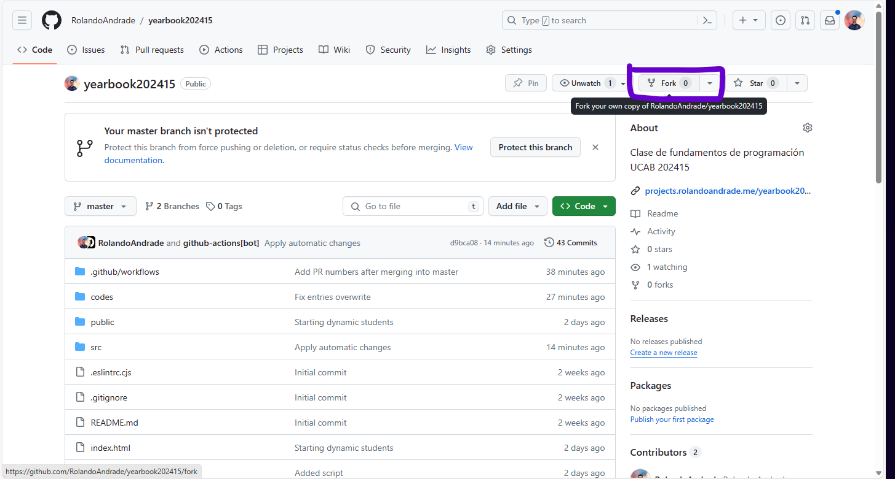
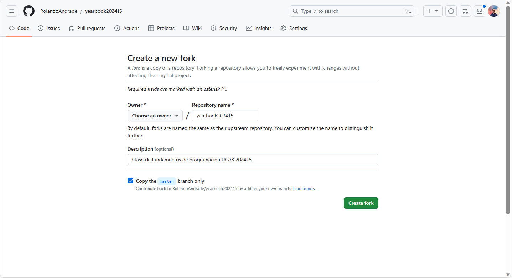
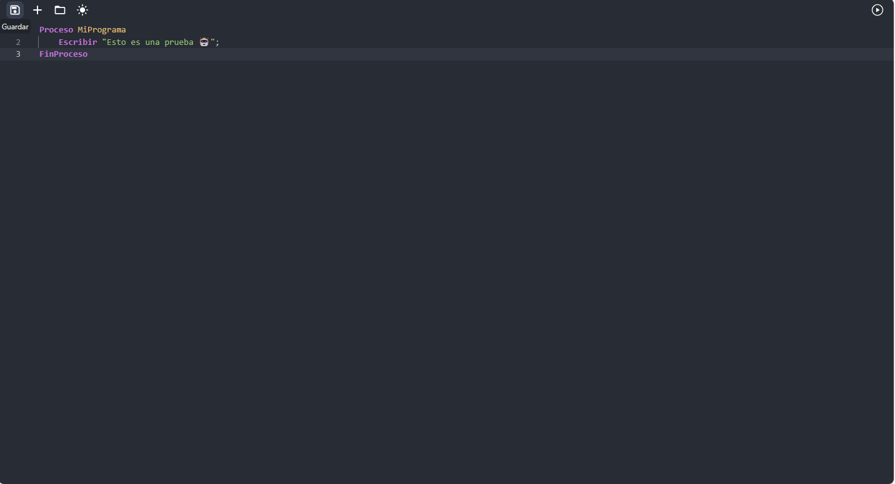
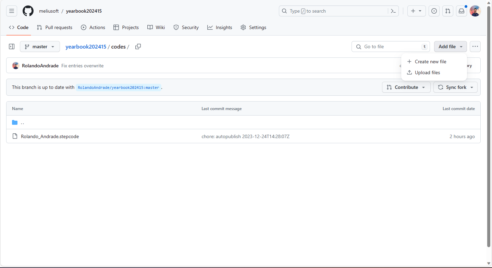
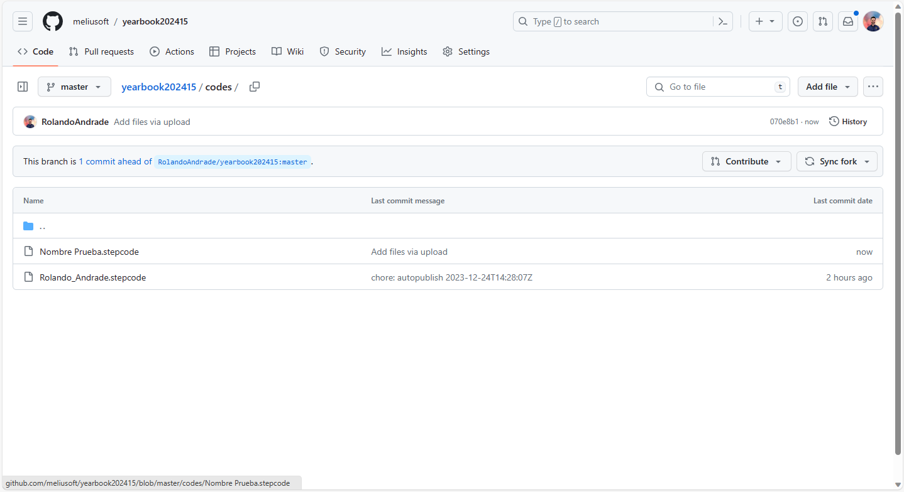
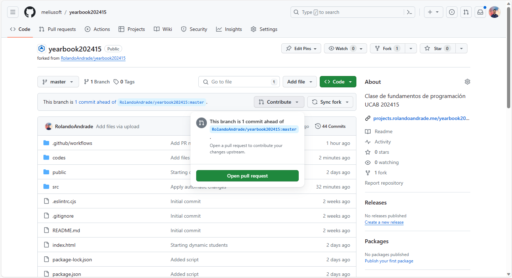
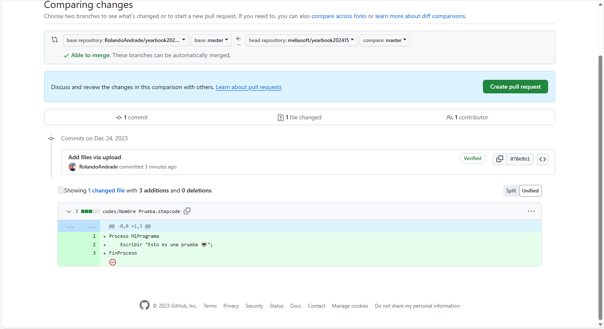
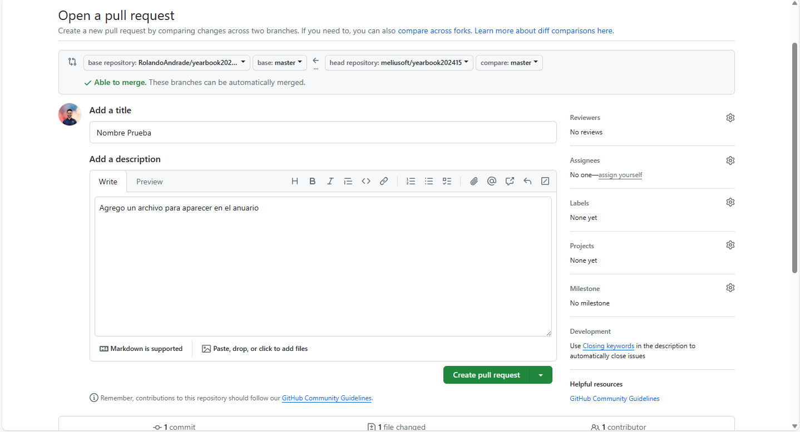
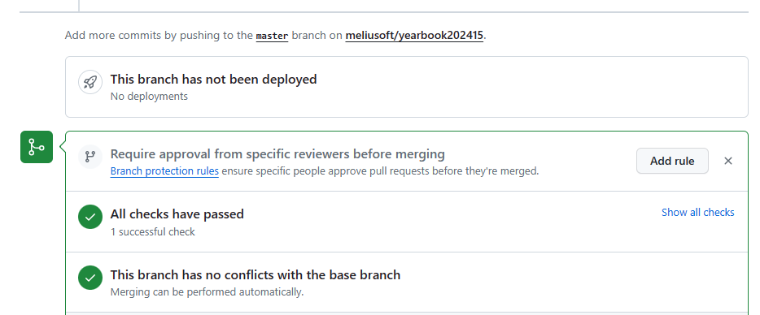
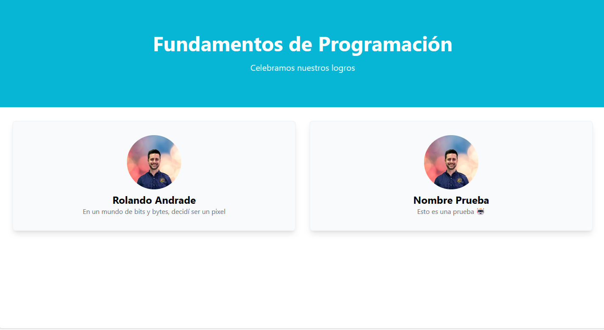

# Anuario de Fundamentos de Programación

Este es el repositorio dedicado al anuario de los estudiantes de Fundamentos de Programación de la Universidad Católica Andrés Bello que
cursaron la materia en el período 202415. 

## ¿Cómo contribuir?

Para contribuir con el anuario, debes seguir los siguientes pasos:

### Haz un fork de este repositorio

Ve a la página principal del repositorio y haz click en el botón `Fork` que se encuentra en la parte superior derecha de la página.



Ahora tendrás una copia de este repositorio en tu cuenta de GitHub con el nombre que desees.



### Agrega un programa StepCode que diga lo que piensas

Entra en la carpeta `codes` y crea un archivo con tu nombre o sobrenombre que desees, pero que termine en `.stepcode`. 

Para ello ve a [StepCode | Editor](https://stepcode.online) y crea tu programa.



Luego de crear tu programa y probarlo, guarda el código en tu computadora presionando el botón `Guardar` en la parte 
superior izquierda del editor de StepCode.

El nombre del archivo debe estar escrito como quieres que se muestre en el anuario, por ejemplo: `Juan Perez.stepcode` mostrará
`Juan Perez` en el anuario, mientras que `juanperez.stepcode` mostrara `juanperez` en el anuario. Puedes representar espacios con
espacios o guiones bajos, por ejemplo: `Juan Perez.stepcode` o `Juan_Perez.stepcode`.

El anuario solo mostrará las salidas de consola de tu programa, por lo que debes asegurarte de que tu programa imprima lo que quieres.
Por ejemplo, para el programa del ejemplo anterior, la salida de consola es:

```
Esto es una prueba 🤖
```

Que es lo que se mostrará en el anuario.

### Agrega tu programa al repositorio

Ahora debes agregar tu programa al repositorio. Para ello, ve a la carpeta `codes` y haz click en el botón `Add file` y luego en `Upload files`.
También puedes arrastrar y soltar tu archivo en la carpeta `codes` o usar git para agregar tu archivo.



En este ejemplo se subió el archivo `Nombre Prueba.stepcode`.



### Crea un Pull Request

Ahora debes crear un Pull Request para que tu programa sea agregado al anuario. Para ello, haz click en el botón `Contribute` y luego en `Open pull request`
ubicado en la parte superior derecha de la página.



Verifica que solo estás agregando tu programa y luego haz click en `Create pull request`.



Escribe un título y una descripción para tu Pull Request y luego haz click en `Create pull request`.



En este ejemplo se usó el título `Nombre Prueba` y la descripción `Agrego un archivo para aparecer en el anuario`.

Con esto, tu Pull Request será creado. Ahora espera a que los checks de GitHub se completen y luego espera a que tu Pull Request sea aprobada
por el profesor.




### ¡Listo!

¡Listo! Tu programa será agregado al anuario y podrás verlo en la página del anuario.

La página del anuario se encuentra en: https://projects.rolandoandrade.me/yearbook202415/



## Consideraciones

- Para las entradas en el anuario solo funcionan programas escritos en StepCode en el
directorio `codes` de este repositorio.
- No se aceptarán Pull Requests con groserías o insultos, que afecten
la entrada de otros estudiantes o que devuelvan salidas muy largas.
- Si sabe de desarrollo web, puede hacer un Pull Request para mejorar la página del anuario y
se aceptarán con mucho gusto.
- Si tiene alguna duda, puede crear un Issue en este repositorio y se le responderá lo más pronto posible.


